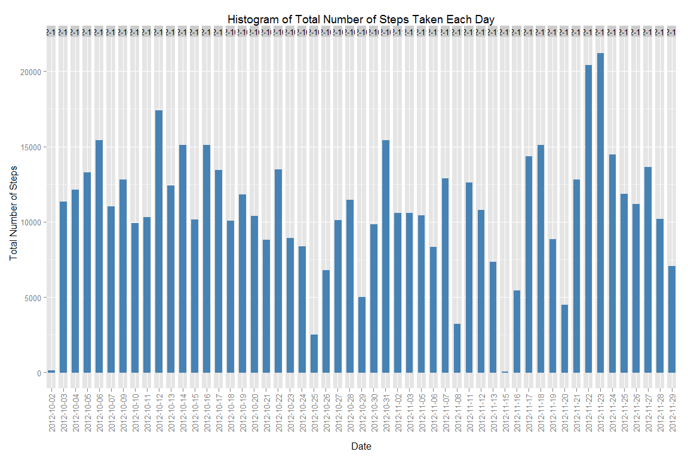
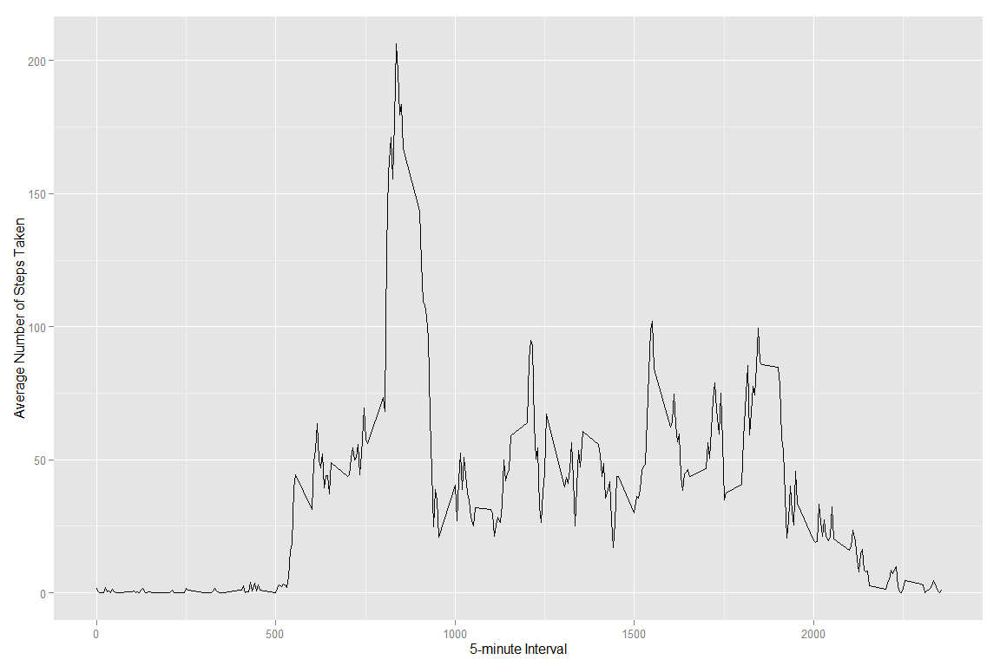
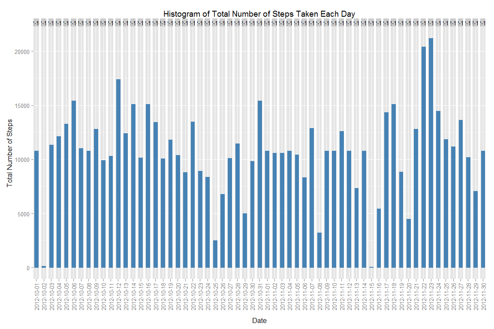
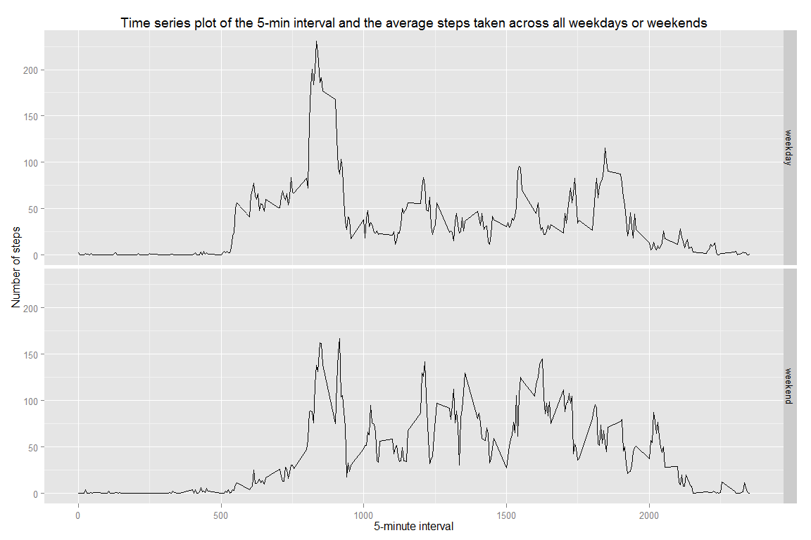

# Reproducible Research: Peer Assessment 1
Rajesh Thallam  
Thursday, May 14, 2015  


```r
options(scipen = 1)
```

## Preamble
This assignment makes use of data from a personal activity monitoring device. This device collects data at 5 minute intervals through out the day. The data consists of two months of data from an anonymous individual collected during the months of October and November, 2012 and include the number of steps taken in 5 minute intervals each day.

## Loading and preprocessing the data
Downloading and extracting data for this assignment from the course web site

```r
# downloading data for the assignment if not available
  url <- "https://d396qusza40orc.cloudfront.net/repdata%2Fdata%2Factivity.zip"
  download.dir <- "data"
  data.dir <- "data"
  zip.file <- file.path(download.dir, "dataset.zip")
  
# download data
  if(!file.exists(download.dir)) { dir.create(download.dir) }
  if(!file.exists(zip.file)) { download.file(url, zip.file) }
  
# extract data
  if(file.exists(zip.file)) { unzip(zip.file, exdir = data.dir, overwrite = TRUE) }
```

Reading and loading the data

```r
# reading activity data
  data <- read.csv("data//activity.csv")
# preview data
  head(data)
```

```
##   steps       date interval
## 1    NA 2012-10-01        0
## 2    NA 2012-10-01        5
## 3    NA 2012-10-01       10
## 4    NA 2012-10-01       15
## 5    NA 2012-10-01       20
## 6    NA 2012-10-01       25
```

## What is mean total number of steps taken per day?

### 1. Calculate the total number of steps taken per day
Total number of steps can be calculated using tapply function with SUM as aggregate function and removing any missing values

```r
# import the package
  library(knitr)
# calculating total number of steps taken per day
  total.steps <- aggregate(steps ~ date, data=data, FUN = sum, na.action = na.omit)
  kable(total.steps, format = "markdown")
```


|date       | steps|
|:----------|-----:|
|2012-10-02 |   126|
|2012-10-03 | 11352|
|2012-10-04 | 12116|
|2012-10-05 | 13294|
|2012-10-06 | 15420|
|2012-10-07 | 11015|
|2012-10-09 | 12811|
|2012-10-10 |  9900|
|2012-10-11 | 10304|
|2012-10-12 | 17382|
|2012-10-13 | 12426|
|2012-10-14 | 15098|
|2012-10-15 | 10139|
|2012-10-16 | 15084|
|2012-10-17 | 13452|
|2012-10-18 | 10056|
|2012-10-19 | 11829|
|2012-10-20 | 10395|
|2012-10-21 |  8821|
|2012-10-22 | 13460|
|2012-10-23 |  8918|
|2012-10-24 |  8355|
|2012-10-25 |  2492|
|2012-10-26 |  6778|
|2012-10-27 | 10119|
|2012-10-28 | 11458|
|2012-10-29 |  5018|
|2012-10-30 |  9819|
|2012-10-31 | 15414|
|2012-11-02 | 10600|
|2012-11-03 | 10571|
|2012-11-05 | 10439|
|2012-11-06 |  8334|
|2012-11-07 | 12883|
|2012-11-08 |  3219|
|2012-11-11 | 12608|
|2012-11-12 | 10765|
|2012-11-13 |  7336|
|2012-11-15 |    41|
|2012-11-16 |  5441|
|2012-11-17 | 14339|
|2012-11-18 | 15110|
|2012-11-19 |  8841|
|2012-11-20 |  4472|
|2012-11-21 | 12787|
|2012-11-22 | 20427|
|2012-11-23 | 21194|
|2012-11-24 | 14478|
|2012-11-25 | 11834|
|2012-11-26 | 11162|
|2012-11-27 | 13646|
|2012-11-28 | 10183|
|2012-11-29 |  7047|

### 2. Make a histogram of the total number of steps taken each day

```r
# importing ggplot2 package
  library(ggplot2)
# drawing histogram
  ggplot(
    total.steps, 
    aes(date, steps)) + 
    geom_bar(stat = "identity",colour = "steelblue", fill = "steelblue", width = 0.7) + 
    facet_grid(. ~ date, scales = "free") + 
    theme(axis.text.x = element_text(angle = 90, vjust = 0.5, hjust=1)) +
    labs(title = "Histogram of Total Number of Steps Taken Each Day", 
    x = "Date", 
    y = "Total Number of Steps"
  )
```

 

### 3. Calculate and report the mean and median of the total number of steps taken per day
Mean total number of steps taken per day is 10766.1887

```r
mean(total.steps$steps, na.rm=TRUE)
```

```
## [1] 10766
```
Mean total number of steps taken per day is 10765

```r
median(total.steps$steps, na.rm=TRUE)
```

```
## [1] 10765
```

## What is the average daily activity pattern?
### 1. Make a time series plot (i.e. type = "l") of the 5-minute interval (x-axis) and the average number of steps taken, averaged across all days (y-axis)
Calculating average number of steps taken for every 5-min interval across all days and plotting time-series analysis

```r
# calculating average number of steps taken for every 5-min interval across all days
  average.steps <- aggregate(
    x=list(steps=data$steps), 
    by=list(interval=data$interval), 
    FUN=mean, 
    na.rm=TRUE)
# plotting time-series
  ggplot(
    data=average.steps, 
    aes(x=interval, y=steps)) +
    geom_line() +
    xlab("5-minute Interval") +
    ylab("Average Number of Steps Taken")
```

 

### 2. Which 5-minute interval, on average across all the days in the dataset, contains the maximum number of steps?
835^th^ 5-minute interval has maximum number of steps across all days

```r
average.steps[average.steps$steps == max(average.steps$steps), ]
```

```
##     interval steps
## 104      835 206.2
```

## Imputing missing values
### 1. Calculate and report the total number of missing values in the dataset (i.e. the total number of rows with NAs)
There are 2304 missing values in the data set.

```r
sum(is.na(data))
```

```
## [1] 2304
```

### 2. Devise a strategy for filling in all of the missing values in the dataset. The strategy does not need to be sophisticated. For example, you could use the mean/median for that day, or the mean for that 5-minute interval, etc.
My strategy would be replace missing values with the mean value for that 5-minute interval.

### 3. Create a new dataset that is equal to the original dataset but with the missing data filled in.

```r
# function to map missing value with mean value for that 5-min interval
  fill.missing.value <- function(steps, interval) {
    return (if (!is.na(steps)) c(steps) else (average.steps$steps[average.steps$interval==interval]))
  }
# map missing values data
  complete.data <- data
  complete.data$steps <- mapply(fill.missing.value, complete.data$steps, complete.data$interval)
  head(complete.data)
```

```
##     steps       date interval
## 1 1.71698 2012-10-01        0
## 2 0.33962 2012-10-01        5
## 3 0.13208 2012-10-01       10
## 4 0.15094 2012-10-01       15
## 5 0.07547 2012-10-01       20
## 6 2.09434 2012-10-01       25
```

```r
  head(data)
```

```
##   steps       date interval
## 1    NA 2012-10-01        0
## 2    NA 2012-10-01        5
## 3    NA 2012-10-01       10
## 4    NA 2012-10-01       15
## 5    NA 2012-10-01       20
## 6    NA 2012-10-01       25
```

### 4. Make a histogram of the total number of steps taken each day and Calculate and report the mean and median total number of steps taken per day. Do these values differ from the estimates from the first part of the assignment? What is the impact of imputing missing data on the estimates of the total daily number of steps?
Calculating total number of steps

```r
  total.steps <- aggregate(steps ~ date, data=complete.data, FUN = sum, na.action = na.omit)
```
Plotting histogram of the total number of steps taken each day

```r
# drawing histogram
  ggplot(
    total.steps, 
    aes(date, steps)) + 
    geom_bar(stat = "identity",colour = "steelblue", fill = "steelblue", width = 0.7) + 
    facet_grid(. ~ date, scales = "free") + 
    theme(axis.text.x = element_text(angle = 90, vjust = 0.5, hjust=1)) +
    labs(title = "Histogram of Total Number of Steps Taken Each Day", 
    x = "Date", 
    y = "Total Number of Steps"
  )
```

 
Calculating mean and median

```r
  mean(total.steps$steps, na.rm=TRUE)
```

```
## [1] 10766
```

```r
  median(total.steps$steps, na.rm=TRUE)
```

```
## [1] 10766
```
1. Mean is same as before imputing the missing data because I replaced missing values with mean value.
2. Median is little higher after imputing missing data as most of the values are same as the mean value.
3. Total steps per daya went higher after imputing the missing data.

## Are there differences in activity patterns between weekdays and weekends?
### 1. Create a new factor variable in the dataset with two levels - "weekday" and "weekend" indicating whether a given date is a weekday or weekend day. 
Pre-processing the data suitable for analysis by deriving day of the week and day type

```r
# determine day of the week
  complete.data$day <- weekdays(as.POSIXct(complete.data$date, format="%Y-%m-%d"))
# determine weekend/weekday
  complete.data$day.type <- ifelse (complete.data$day == "Saturday" | complete.data$day == "Sunday", "weekend", "weekday")
# preview data
  head(complete.data)
```

```
##     steps       date interval    day day.type
## 1 1.71698 2012-10-01        0 Monday  weekday
## 2 0.33962 2012-10-01        5 Monday  weekday
## 3 0.13208 2012-10-01       10 Monday  weekday
## 4 0.15094 2012-10-01       15 Monday  weekday
## 5 0.07547 2012-10-01       20 Monday  weekday
## 6 2.09434 2012-10-01       25 Monday  weekday
```

### 2. Make a panel plot containing a time series plot (i.e. type = "l") of the 5-minute interval (x-axis) and the average number of steps taken, averaged across all weekday days or weekend days (y-axis). 

```r
# Average number of steps taken for 5-min interval across weekday and weekend
  average.steps.day.type <- aggregate(steps ~ interval + day.type, data=complete.data, mean)
# Plotting time series analysis
  ggplot(
    average.steps.day.type, 
    aes(interval, steps)) + 
    geom_line() + facet_grid(day.type ~ .) +
    labs(title = "Time series plot of the 5-min interval and the average steps taken across all weekdays or weekends",
    x = "5-minute interval",
    y = "Number of steps")
```

 
